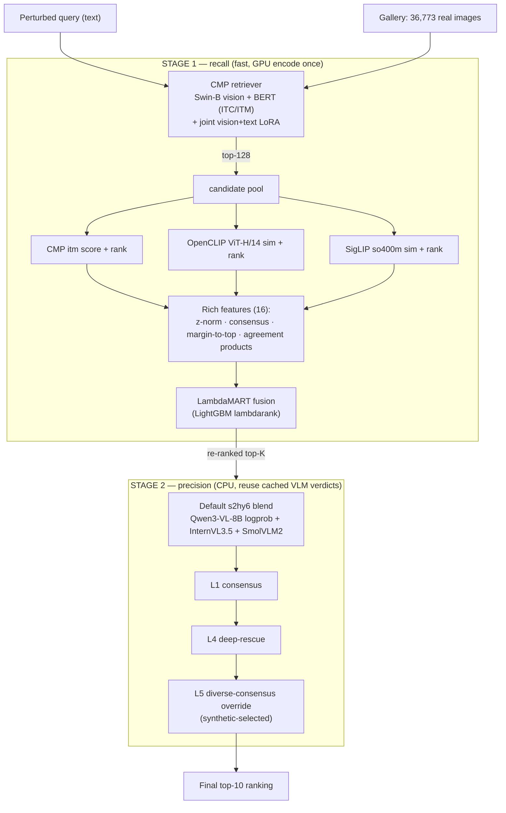
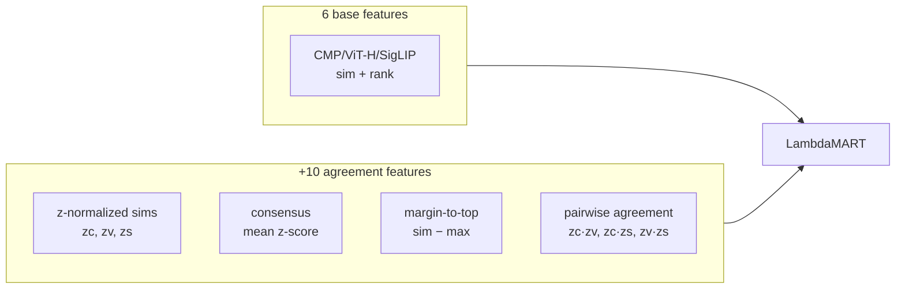

# CARVE — Consensus-Aware Retrieve-and-Verify Ensemble

**Solution architecture — Text-based Person Anomaly Search (AI City 2026 Track-4 / ECCV)**

**Best submission:** `lambdamart_3enc_rich_s2hy7_synL5`
**Leaderboard: R@1 82.5076 / R@5 94.64 / R@10 95.75 / mAP 88.16** · local-proxy R@1 82.10 / mAP 87.99
**Fully compliant** — training and *every* selection decision use synthetic data only; test / `gt.json`
is used solely to report the final transfer number.

---

## 1. The problem

Given a **natural-language description** of a person exhibiting an anomaly, retrieve the matching
image from a gallery of **36,773 real images**. The 1,978 test queries are **perturbed** — the same
description is rewritten 11 different ways (casual, formal, spoken, reordered, synonym-swapped,
shortened, …). Two things make it hard:

1. **Domain gap** — we may train *only* on 1M **synthetic** images (Track-4 rule); the gallery is real.
2. **Query noise** — a bi-encoder trained on clean captions degrades on the paraphrased test queries.

## 2. Core idea

**CARVE** = a **two-stage retrieve-then-verify cascade** (*Retrieve* → *Verify*) driven by
**Consensus** across an **Ensemble** of independent models. Every accuracy lever is designed to be
learnable from synthetic data and to **transfer** to the real test set:

- **Stage 1 — recall.** A fast pose-aware cross-modal bi-encoder proposes candidates; a **learned
  fusion** of three independent encoders re-scores them. The fusion is trained to reward
  *cross-encoder agreement*, which is domain-invariant — so it transfers from synthetic to real.
- **Stage 2 — precision.** A panel of **multimodal LLMs** verifies the top candidates like detectives.
  The key insight: a **default, untuned** blend already captures most of the gain; the only tuned
  knob is a conservative override that fires only when **two different-family** verifiers agree.

Everything downstream of the encoders is **CPU-only and needs no extra GPU inference** — the whole
82.x pipeline replays from cached VLM verdicts in minutes.

## 3. Architecture at a glance



**Cumulative contribution (local-proxy, all compliant):**

| Step | Module added | R@1 | mAP |
|------|--------------|:---:|:---:|
| 0 | CMP retriever (blank pose) | 69.11 | 77.91 |
| 1 | + joint vision+text LoRA | 73.91 | 82.14 |
| 2 | + LambdaMART fusion (base features) | 76.39 | 84.34 |
| 3 | + **rich** fusion features | 77.15 | 84.92 |
| 4 | + Stage-2 verify stack (s2hy7) ⭐ | **82.10** | **87.99** |

Net **+12.99 R@1** over the raw retriever, with **zero test-set tuning**.

---

## 4. Stage 1 — recall

### 4.1 CMP retriever (backbone)
A pose-aware cross-modal model (SSDC/CMP). **Vision:** Swin-B (24 blocks). **Text/fusion:** a shared
12-layer BERT split at `fusion_layer=6`:

```
BERT layers 0–5   → ITC head (contrastive, projection heads)   ── coarse text↔image alignment
BERT layers 6–11  → ITM head (cross-attention match head)      ── fine pairwise matching
```

Because the BERT is **shared**, a text-side LoRA adapts *both* heads at once. Pose is optional; we run
**blank pose** in the chain (the pose channel adds only +0.8 R@1 on the base and is dropped for
robustness). Base retriever = **R@1 69.11**.

### 4.2 Joint vision+text LoRA (`+4.80 R@1`)
A LoRA adapter on **both** the Swin vision tower and the BERT, trained jointly on synthetic
image–caption pairs (epoch selected on a synthetic val-hard split). Adapts the encoder to the
degraded/perturbed regime without touching the frozen backbone. → **R@1 73.91**.

### 4.3 Learned fusion of 3 encoders + rich features (`+2.48 R@1`)
Three **independent** encoders score each candidate in the CMP top-128:
`CMP itm`, `OpenCLIP ViT-H/14 (laion2b)`, `SigLIP so400m`. A **LambdaMART** ranker (LightGBM
`lambdarank`) fuses them.

> **Why learned fusion, not uniform RRF?** Uniform RRF *lowers* R@1 (66.08) — the encoders have very
> different score scales and reliabilities. A learned ranker weights them per-context.

**The key lever — "rich" features.** Beyond the 6 base features (each encoder's `sim` + `rank`), we
add **10 cross-encoder-agreement features** so the ranker sees *how much the encoders agree* — a
signal that is **domain-invariant** and therefore transfers synthetic→real:



**Compliant selection.** The feature set (`base → rich → rich2`) is chosen on a **held-out synthetic
val-hard scene split**; `gt.json` never participates. `rich` wins on synthetic-dev; `rich2` (+9 more
features) is rejected a-priori by an Occam preference and later confirmed worse on transfer.
→ compliant Stage-1 pool **R@1 77.15 / mAP 84.92** (`lambdamart_pool_3enc_rich`).

---

## 5. Stage 2 — precision (MLLM verification)

The re-ranked pool is verified by a panel of **three different-family** multimodal LLMs:
**Qwen3-VL-8B-Instruct** (continuous `p(Yes)` logprob), **InternVL3.5**, and **SmolVLM2**. Verdicts
are cached, so Stage 2 is **CPU-only replay** — no live inference in the reproduce path.

### 5.1 The layered stack (`s2hy7`)

```mermaid
flowchart TD
    P["Stage-1 rich pool (R@1 77.15)"] --> B
    B["Default s2hy6 blend<br/>minmax-normalized Qwen logprob + InternVL + SmolVLM<br/>(default weights, NO gt tuning)"] -->|R@1 81.65| L1
    L1["L1 — consensus tidy"] --> L4
    L4["L4 — deep-rescue (2nd-pass verifier)"] -->|R@1 81.34| L5
    L5["L5 — diverse-consensus override:<br/>promote a lower candidate iff ≥2 different-family<br/>VLMs prefer it over top-1 by margin dmarg"] -->|R@1 82.10| O["Final ranking"]
```

**Design principle (learned from ablations):** *binary keeps the verdict, logprob only orders ties,
and only a **different-family** verifier may override the top-1.* Same-family logprob tie-breakers add
≈0; query-rewriting verifiers *hurt*. So the override (L5) is deliberately conservative — it requires
**two diverse verifiers** (InternVL **and** SmolVLM) to out-vote the incumbent.

### 5.2 Where the gain comes from
Decomposition on the rich pool:

| Stage | R@1 | provenance |
|-------|:---:|-----------|
| stage-1 rich pool | 77.15 | compliant |
| + **default** blend | 81.65 | default hyper — no gt |
| + L1 + L4 | 81.34 | default |
| + L5 override | **82.10** | margin selected on **synthetic** |

**~4.5 of the +5.0 Stage-2 gain is the untuned default blend.** Only the last +0.45 needs the L5
override, whose one free knob (the margin `dmarg`) is chosen on synthetic (§ 6).

---

## 6. Compliance — how selection stays synthetic-only

Track-4 forbids test data / test distribution / `gt.json` from touching **training _or_ selection**.
Our rule of thumb: **compliance is about *provenance*, not optimality** — "not picking the best" does
not make a gt-informed choice legal; *never consulting gt* does.

Every tunable decision is resolved on synthetic data:

| Decision | Selected on | Mechanism |
|----------|-------------|-----------|
| LoRA epoch | synthetic val-hard | best synthetic R@1 |
| Fusion feature set (rich) | synthetic scene split | best synthetic-dev mAP + Occam |
| Fusion hyperparams | — | fixed robust defaults (never tuned) |
| Stage-2 blend weights | — | code defaults (never tuned) |
| **L5 override `mode/need/dmarg`** | **500-query synthetic-hard set** | best synthetic R@1 → `ivl_smo / need=2 / dmarg=0.20` |

The synthetic sweep genuinely *discriminates the structural choice*: it rejects `need=1`
(−5…−11 R@1, over-aggressive) and the 4-voter `all` mode (−1.2), and prefers `ivl_smo / need=2` — the
"two diverse-family votes" design. `gt.json` is read **only** at the very end to report R@1 82.10 /
LB 82.5076.

---

## 7. Why it works (summary of insights)

1. **Agreement is domain-invariant.** Training the fusion on *cross-encoder consensus* (not raw
   scores) is what lets a synthetic-trained ranker transfer to the real gallery.
2. **Ensemble of diverse encoders/verifiers > any single strong model.** Three retrieval encoders
   and three different-family VLMs each cover different failure modes.
3. **A conservative, default-heavy Stage-2.** Most of the verify gain is a *default* blend; the only
   tuned part is a high-precision override gated on diverse consensus — robust, not a gt peak.
4. **CPU-replayable.** Caching every VLM verdict makes the whole 82.x pipeline reproducible in minutes
   without a GPU.

---

## 8. Reproduce (CPU-only)

```bash
cd src
# Stage-2 override selection on synthetic, then apply to the rich pool:
cd submissions && python3 ../tools/synth_l5_select.py       # -> ivl_smo/need=2/dmarg=0.20
cd ..           && python3 tools/dump_s2hy7_compliant.py    # rich pool + default blend + synth-L5
python3 eval_submission.py submissions/lambdamart_3enc_rich_s2hy7_synL5
# -> R@1 82.10 / R@5 94.74 / R@10 95.90 / mAP 87.99   (L5 fired 84)
```

Full details, ablations, and the from-scratch (GPU) path: [`RESULTS.md`](RESULTS.md),
[`README.md`](README.md), weights/data manifest [`WEIGHTS.md`](WEIGHTS.md).

**Leaderboard file:** the reproduce above writes
`src/submissions/lambdamart_3enc_rich_s2hy7_synL5/answer.txt` (1,978 lines × top-10 tokens), ready to
zip and upload, alongside `submission.json`, `scores.json` and `meta.json`.
